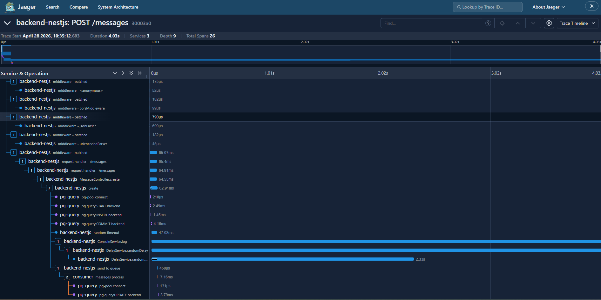

# Distributed Tracing with OpenTelemetry, NestJS and Jaeger

A NestJS backend demonstrating distributed tracing across HTTP requests, message queues, and database queries using OpenTelemetry and Jaeger.

## Architecture

```
Client (HTTP) --> backend-nestjs --> RabbitMQ --> consumer --> PostgreSQL
                       |                            |
                       v                            v
                   PostgreSQL                   pg-query
                   (pg-query)
                       \                          /
                        \                        /
                     OpenTelemetry Collector (gRPC :4317)
                                |
                            Jaeger UI (:16686)
```

### Traced services

| Service | Description |
|---|---|
| **backend-nestjs** | HTTP layer - Express middlewares, NestJS controllers, service methods, RabbitMQ producer |
| **consumer** | RabbitMQ consumer - processes messages from the queue |
| **pg-query** | All PostgreSQL queries (INSERT, UPDATE, SELECT, etc.) from both backend and consumer |

## Trace example

Below is a real trace from Jaeger showing a `POST /messages` request flowing through all 3 services with 26 spans:



The trace shows the full lifecycle of a message:

1. **backend-nestjs** receives the HTTP request, runs through Express middlewares, and enters `MessageController.create`
2. **pg-query** executes `START`, `INSERT`, and `COMMIT` to persist the message
3. **backend-nestjs** runs the `random timeout` span (simulated delay)
4. **backend-nestjs** calls `ConsoleService.log` and `DelayService.randomDelay` (auto-traced via `@Traceable()` decorator)
5. **backend-nestjs** publishes the message to RabbitMQ via `send to queue` span
6. **consumer** picks up the message and processes it under the same trace ID
7. **pg-query** executes the `UPDATE` to mark the message as processed

## Prerequisites

- Docker and Docker Compose
- Node.js 18+

## Getting started

### 1. Start the infrastructure

```bash
docker compose up -d
```

This starts:

| Service | Port |
|---|---|
| PostgreSQL | 5432 |
| RabbitMQ | 5672 (AMQP), 15672 (management UI) |
| Jaeger | 16686 (UI) |
| OTel Collector | 4317 (gRPC), 4318 (HTTP) |

### 2. Start the backend

```bash
cd backend
npm install
npm run start:dev
```

The backend runs on port **3333**.

### 3. Send a request

```bash
curl -X POST http://localhost:3333/messages \
  -H "Content-Type: application/json" \
  -d '{"content": "Hello from curl"}'
```

### 4. View traces

Open Jaeger UI at [http://localhost:16686](http://localhost:16686) and select any of the 3 services to explore traces.

## Project structure

```
telemetry/
  docker-compose.yaml          # Infrastructure (Postgres, RabbitMQ, Jaeger, OTel Collector)
  collector-config.yaml         # OTel Collector pipeline config (OTLP -> Jaeger)
  config-ui.json                # Jaeger UI theme configuration
  backend/
    src/
      tracing.ts                # OpenTelemetry SDK setup (backend-nestjs + pg-query providers)
      traceable.decorator.ts    # @Traceable() decorator for automatic service method tracing
      main.ts                   # NestJS bootstrap (port 3333, CORS, ValidationPipe)
      app.module.ts             # Root module (TypeORM, RabbitMQ, Message modules)
      message/
        message.controller.ts   # POST /messages endpoint
        message.service.ts      # Creates message, publishes to RabbitMQ
        message.consumer.ts     # Consumes from RabbitMQ, updates message status
        message.entity.ts       # TypeORM entity (id, content, status, createdAt)
        create-message.dto.ts   # Validation DTO (content: string, required)
        console.service.ts      # Logging service (auto-traced via @Traceable)
        delay.service.ts        # Random delay service (auto-traced via @Traceable)
      rabbitmq/
        rabbitmq.service.ts     # RabbitMQ connection, publish (with trace headers), consume
```

## How tracing works

### Trace context propagation through RabbitMQ

The producer injects the W3C `traceparent` header into AMQP message headers:

```typescript
const headers: Record<string, string> = {};
propagation.inject(context.active(), headers);
await this.rabbitmqService.publish(queue, data, headers);
```

The consumer extracts it to continue the trace:

```typescript
const headers = msg.properties.headers;
const parentContext = propagation.extract(context.active(), headers);
await context.with(parentContext, () => { /* traced work */ });
```

### Separate service names via TracerProviders

Each service uses its own `BasicTracerProvider` with a distinct `service.name`:

- **backend-nestjs** - global `NodeSDK` provider
- **pg-query** - separate provider registered with `PgInstrumentation`
- **consumer** - separate provider created in `MessageConsumer`

### Automatic method tracing with @Traceable()

The `@Traceable()` class decorator wraps every method of a NestJS service with an OpenTelemetry span. Add it to any `@Injectable()` service:

```typescript
@Traceable()
@Injectable()
export class MyService {
  myMethod() { /* automatically creates a span "MyService.myMethod" */ }
}
```

## API

| Method | Path | Body | Description |
|---|---|---|---|
| GET | `/` | - | Health check |
| POST | `/messages` | `{ "content": "string" }` | Create a message (persists, queues, and processes) |

## Environment variables

| Variable | Default | Description |
|---|---|---|
| `PORT` | `3333` | Backend HTTP port |
| `SERVICE_NAME` | `backend-nestjs` | OpenTelemetry service name |
| `OTEL_EXPORTER_OTLP_ENDPOINT` | `http://localhost:4317` | OTel Collector gRPC endpoint |
| `DB_HOST` | `localhost` | PostgreSQL host |
| `DB_PORT` | `5432` | PostgreSQL port |
| `DB_USER` | `guest` | PostgreSQL user |
| `DB_PASS` | `guest` | PostgreSQL password |
| `DB_NAME` | `backend` | PostgreSQL database name |
| `RABBITMQ_HOST` | `localhost` | RabbitMQ host |
| `RABBITMQ_USER` | `guest` | RabbitMQ user |
| `RABBITMQ_PASS` | `guest` | RabbitMQ password |
